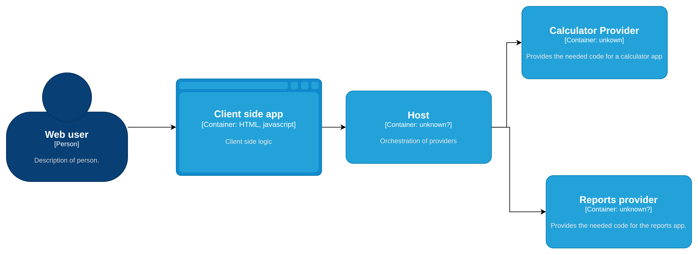
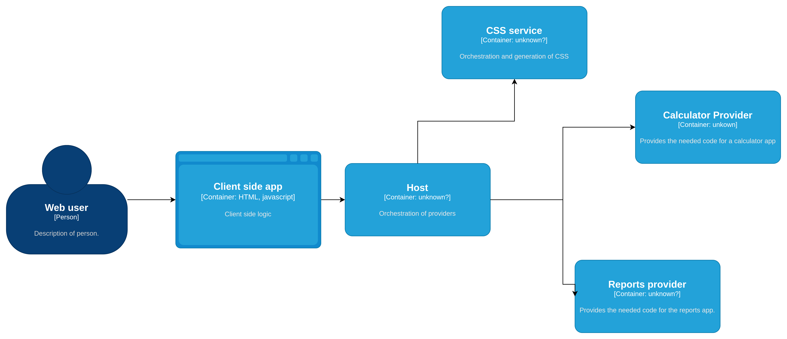

# Distributed Provider CSS Management

*An idea for building protocols for micro-frontend CSS orchestration*

## Abstract

When composing applications at runtime from multiple independent providers (teams, services, or subsystems), we face a CSS efficiency challenge: how do we avoid duplication, maintain performance, and properly split critical from deferable CSS without sacrificing the independence of each provider?

This document proposes a candidate-based protocol that enables efficient CSS composition in distributed, runtime-assembled applications. The protocol defines a standardized contract between hosts and providers, allowing:

- **Elimination of CSS duplication** across independent providers
- **Automatic critical/deferable CSS splitting** at composition time
- **Strict performance budgets** (2KB critical CSS limit)
- **Support for distributed development** with multiple technologies
- **Integration with existing CSS methodologies** (Tailwind, BEM, etc.)

This protocol is particularly suited for micro-frontend architectures with server-side rendering where providers are composed at runtime rather than build time.

## 1. Introduction

### 1.1 The Problem

Modern web applications increasingly adopt micro-frontend architectures where multiple independent teams develop, deploy, and maintain separate parts of an application. When these parts (providers) are composed at runtime on the server, CSS management becomes challenging:

- **Duplication**: Each provider develops independently, leading to duplicated CSS rules
- **Performance**: Critical CSS must load immediately while deferable CSS should not block rendering
- **Independence**: Providers shouldn't need to coordinate their CSS with other providers
- **Efficiency**: Unused CSS wastes bandwidth and parsing time

Traditional solutions like shipping a monolithic CSS library or letting each provider manage its own styles fail to address all these concerns simultaneously.

### 1.2 The Solution: Candidate-Based Protocol

This protocol introduces a three-part system:

1. **Providers emit "candidates"** - a list of CSS class names they need
2. **A central system generates CSS** from these candidates, handling deduplication
3. **The host determines critical vs deferable** based on what's visible on initial load

This approach maintains provider independence while achieving CSS efficiency at the system level.

## 2. Background

### 2.1 The Host/Providers Model

The host/providers model is the architectural foundation of this protocol. A **host** is an application or system that orchestrates multiple **providers**, each contributing a portion of the final application.

For example, a hypothetical framework could have something like this:

```xml
<div>
  <h1>
    Welcome to my dashboard
  </h1>
  <!-- Yes, we know that we should avoid inline styles, this is an example -->
  <div style="display: flex;">
    <custom-includes-element 
      source="https://some_remote_server/calculator_app/v1" 
    />
    <custom-includes-element
      source="https://another_team_remote_server/reports_app/v4"
    />
  </div>
</div>
```

Then, for the final user the HTML created in the server would be like this:

```xml
<div>
  <h1>
    Welcome to my dashboard
  </h1>
  <div style="display: flex;">
    <div> 
      <!-- Some code that belongs to the calculator app -->
    </div>
    <div>
      <!-- Some code that belongs to the reports app -->
    </div>
  </div>
</div>
```



This resembles templating systems, but with a key difference: providers already have their HTML resolved, rather than letting the host do all the computation. This enables true runtime composition where providers are independent and can be developed, deployed, and scaled separately.

Providers can be:
- **Remote**: Hosted on different servers, owned by different teams or organizations
- **Local**: Stub providers that resolve immediately within the same system

This flexibility is essential for micro-frontend architectures and distributed development.

### 2.2 The CSS Challenge in Distributed Systems

#### 2.2.1 The Duplication Problem

When providers are distributed (remote servers, different teams, independent deployments), CSS duplication becomes inevitable. Each provider develops independently, and even if they follow the same design system, they may structure their CSS differently.

For example, let's say we have:

Provider A:
```css
.button{
  background-color: red;
  padding-inline: 2px;
  padding-block: 4px;
  border: none;
}
```

And in Provider B:
```css
button{
  border: none;
}

.button {
  padding-inline: 2px;
  padding-block: 4px;
}

.button--primary{
  background-color: red;
}
```

As you can notice, the CSS is repeated but structured (architected) differently. This happens because:
- Different teams work independently
- Providers can't access each other's CSS in distributed architectures
- Even the same team may forget to reuse CSS across providers when they're separated

This document addresses runtime composition specifically - where navigation events trigger composition and we don't rebuild the entire application when one provider changes.

We presuppose that most styling is done via HTML classes. To learn more about this architectural approach, see [CSS Layers as Architectural Contracts](https://medium.com/@pieroramirez810/css-layers-as-architectural-contracts-1b7aa9595cd2?source=your_stories_outbox---writer_outbox_published-----------------------------------------).

#### 2.2.2 Why Traditional Approaches Fall Short

**Single Source of Truth Problem**: Traditional solutions suggest having a standardized single source of truth CSS library shipped to the browser. However, this creates issues:

1. **Unused CSS bloat**: A single monolithic CSS file (often minified) ships with all pre-defined classes. Since providers are only known at runtime, much of the CSS remains unused, adding unnecessary bytes. The more edge cases the system supports, the larger this CSS becomes.

2. **Cannot separate critical from deferable**: With everything in one stylesheet, we lose the ability to distinguish what's critical for initial paint versus what can be deferred:

```css
/* All the CSS here is shipped in one stylesheet */
.button{
  /* some styles */
}

.button:hover{
  /* some other styles that would be better deferred */
}
```

With a monolithic stylesheet, we need a separate process to extract critical CSS, and that critical CSS should ideally be in an internal `<style>` tag within the `<head>` to avoid additional network round trips.

#### 2.2.3 Performance Requirements

**Critical CSS** refers to CSS declarations essential for the initial paint without visual regressions. These regressions include:
- **FOUC (Flash of Unstyled Content)**: Unstyled content flashes before proper styles are applied
- **Layout shifts**: Elements "teleport" to different positions as styles arrive
- **Visual jumps**: Content moves or repositions when CSS loads

The way to tell the browser to load CSS declarations and block rendering until those declarations are loaded is to put them in a `<style>` tag inside the `<head>` block. While this can reference external CSS files, it's advisable to use internal CSS because this CSS blocks rendering - avoiding the round trip to a server is critical for performance.

**Deferable CSS** contains declarations not essential for the initial paint (interactions, hover states, below-the-fold content) and can safely load after the HTML is parsed, allowing the page to render faster.

**Budget constraint**: Critical CSS must be under 2KB minified for the entire page to maintain fast initial render times.

## 3. The Solution: Candidate-Based CSS Generation

We need a robust standardization system that enables extensibility for styling solutions. This is typically implemented through **design systems**.

**High-level approach:**
1. Providers emit a list of CSS class "candidates" they need
2. A central system generates the actual CSS from these candidates, handling deduplication
3. The host determines what's above the fold and splits CSS into critical (inline, blocking) and deferable (async, non-blocking)

### 3.1 Key Benefits

- **No CSS duplication**: Central system deduplicates candidates across all providers
- **Automatic optimization**: Critical/deferable split happens at composition time based on actual usage
- **Provider independence**: Providers only need to declare what classes they use
- **Performance control**: Host enforces the 2KB budget and determines rendering strategy
- **Flexibility**: Works with any CSS methodology (Tailwind, BEM, CSS Modules, etc.)

## 4. Protocol Specification

### 4.1 Core Concepts

#### 4.1.1 What are Candidates?

**Candidates** are HTML class names that a provider declares it needs. This concept is heavily inspired by **TailwindCSS**.

A provider emits a list of class names:

```json
// provider A
{
  "candidates": ["button", "text-color-red-500"]
}
```

The central system knows how to generate the CSS for `.button` and `.text-color-red-500`.

**Deduplication**: When consuming multiple providers:

```json
// provider B
{
  "candidates": ["button", "button--primary"]
}
```

The central system MUST handle deduplication automatically. The final list of candidates becomes: `button, button--primary, text-color-red-500`.

#### 4.1.2 Above the Fold

**Above the fold** refers to content visible on initial page load without scrolling. Only critical CSS from above-the-fold providers blocks rendering.

The host application MUST explicitly declare which providers are "above the fold" - visible on initial page load. This can be done via configuration or markup (implementation detail).

Example markup approach:
```xml
<above-the-fold>
  <custom-includes-element source="https://example.com/header"/>
</above-the-fold>

<custom-includes-element source="https://example.com/footer"/>
```

**Critical CSS extraction rules:**
- Only critical CSS from above-the-fold providers is inlined in `<style>` tags (blocking render)
- Critical CSS from below-the-fold providers is deferred, even if marked as critical by the provider
- This ensures we stay under the 2KB critical CSS budget

### 4.2 Provider Contract

**Provider Response** (minimal required schema):
```typescript
interface ProviderResponse {
  candidates: string[];        // MUST: List of CSS class names needed
  rawCSS?: {                   // MAY: Custom CSS when candidates aren't enough
    critical?: string;
    deferable?: string;
  };
  // Other fields MAY be included based on implementation needs
}
```

**Note**: While JSON is shown here, the response format can be anything (binary via gRPC, etc.). Like GraphQL, different processes may request different parts of this contract based on their needs.

**Critical CSS as hints**: The **critical** CSS from providers is treated as **hints**, not absolute requirements. Not all providers are visible on first load, and during HTML streaming, visibility changes. The host makes the final determination of what's critical based on above-the-fold positioning.

### 4.3 Host Contract

**Host Responsibilities** (MUST):
- Deduplicate candidates across all providers
- Determine which providers are above the fold
- Enforce the 2KB critical CSS budget for the entire page
- Provide a mechanism for marking providers as above the fold

### 4.4 Central System Contract

**Central System Interface** (MUST provide):
- A way to register CSS generation rules for candidates
- A method to generate critical CSS from candidates
- A method to generate deferable CSS from candidates (optionally requested)
- Support for deduplication

## 5. Implementation

### 5.1 Registering CSS for Candidates

The central system needs a way to map candidates to their CSS and distinguish critical from deferable parts.

**Example: JSS-style registration** (hypothetical library):

```ts
import { registerCSS } from '@design-system/css-register'

registerCSS.component('button--primary', (tokens) => ({
  critical: {
    '&': {
      backgroundColor: tokens.color.get('primary-bg')
    }
  },
  deferable: {
    ':hover': {
      backgroundColor: tokens.color.from('primary-bg').darken(50)
    }
  }
}))
```

**Example: Raw CSS registration** (more portable):

```ts
import { registerCSSFromRaw } from '@design-system/css-register'

registerCSSFromRaw.component('button--primary', {
  critical: `
    .button--primary {
      background-color: var(--colors--primary-bg);
    }
  `,
  deferable: `
    .button--primary:hover {
      background-color: darken(var(--colors--primary-bg), 50%);
    }
  `
})
```

Registration is not limited to strings - CSS can be read directly from files.

**Integration with existing tools**: The central system MAY integrate with popular CSS engines like Tailwind instead of requiring explicit registration for every candidate. Such integrations MUST be documented.

### 5.2 Generating CSS

Example of consuming the central system:

```ts
import { generateCriticalCSS } from '@design-system/css-generator'

const criticalCSS = await generateCriticalCSS(
  ["button", "text-color-red-500"], 
  ["button", "button--primary"]
)

// Will contain at least:
/*
  @layer components {
    .button--primary {
      background-color: var(--colors--primary-bg);
    }
  }
*/
console.log(criticalCSS)
```

### 5.3 Handling Edge Cases

#### 5.3.1 Custom CSS (rawCSS)

Standardized candidates solve known cases, and utility classes cover most scenarios. However, providers occasionally need custom CSS for edge cases.

Providers MAY include raw CSS in their response:

```json
{
  "candidates": ["some-candidate"],
  "rawCSS": {
    "critical": "some css considered critical",
    "deferable": "some css that may be deferred"
  }
}
```

The `deferable` field is optional even within `rawCSS`, as it may be large. Implementation MAY choose to request deferable CSS separately.

#### 5.3.2 Network Resilience

External stylesheets can fail to load due to network issues. To mitigate this, implementations MAY offer an option to stream critical CSS for below-the-fold providers at the end of the HTML document (non-blocking).

**Trade-off**: This approach prevents reusing cached stylesheets across navigations. Consider carefully based on:
- Target audience network reliability
- Application navigation patterns
- Performance budget priorities



#### 5.3.3 Budget Violations

The 2KB minified budget is for the **entire page's critical CSS**, not per provider. The CSS generation system MUST:
- Track cumulative critical CSS size
- Warn or fail when budget is exceeded
- Optionally offer fallback strategies when providers exceed budget

Specific fallback behavior is an implementation detail.

## 6. Architectural Considerations

### 6.1 Flexibility

The diagrams show containerized services, but the architecture is flexible:
- The CSS generation system can be a component within the host
- Providers can be components in a monolithic system rather than distributed services
- The choice depends on your specific needs and constraints

### 6.2 Performance Constraints

**MUST NOT**: Generate CSS on the client-side main thread. Clients run on user devices with varying capabilities. More resource consumption increases the likelihood of poor performance.

CSS generation SHOULD happen:
- At request time (server-side) with caching
- During build time for static providers
- In a separate worker thread if client-side processing is unavoidable

### 6.3 When NOT to Use This System

This protocol is designed for specific architectural challenges. Consider alternatives when:
- Building simple, static websites with full CSS control
- Working with a small application where all code is co-located
- Build-time bundling is sufficient for your needs
- You don't have multiple independent providers
- Performance requirements don't justify the complexity

This system shines in:
- Micro-frontend architectures with server-side rendering
- Multi-team organizations with independent deployments
- Runtime composition of distributed providers
- Scenarios requiring strict critical CSS budgets